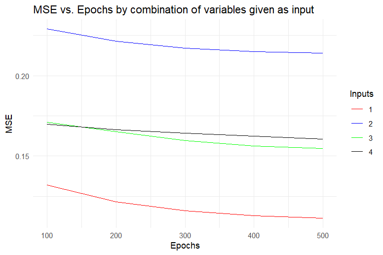
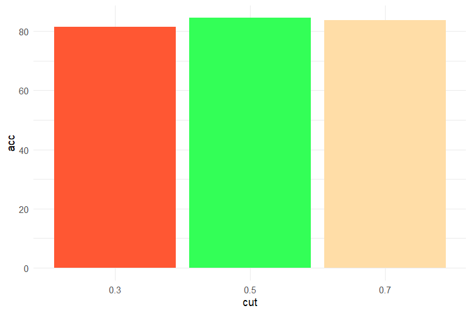
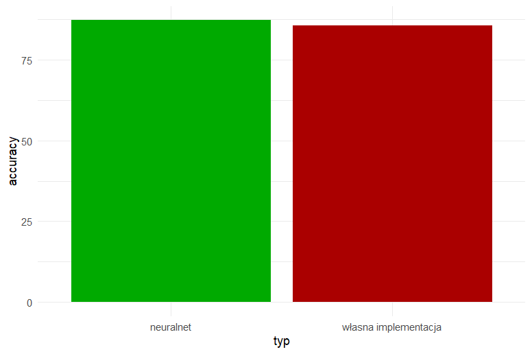

# Sieć neuronowa do klasyfikacji

W ramach zadania zaimplementowano sieć neuronową typu MLP (Multi-Layer Perceptron) od podstaw. Proces uczenia oparto na algorytmie wstecznej propagacji błędu (backpropagation).

# Analiza porównawcza

## Funkcja aktywacji

Wybór funkcji aktywacji determinuje zdolność sieci do mapowania nieliniowych zależności. Porównano funkcje:

-   sigmoid
-   tanh

.png){fig-align="center" width="80%"}

Jak widać na powyższym wykresie tanh wykazuje się mniejszym błędem MSE na przestrzeni 500 epoch. Sigmoid uczy się szybciej, lecz wraz ze zmniejszaniem się błędu, tempo nauki spada.

## Liczba neuronów w warstwach ukrytych

Zbyt mała liczba neuronów może prowadzić do "underfittingu", natomiast zbyt duża drastycznie zwiększa koszt obliczeniowy.

.png){fig-align="center" width="80%"}

Liczba 12 neuronów w jednej wartstwie ukrytej wykazuje się najniższym MSE oraz najwyższą dokładnością predykcji. Taka konfiguracja sieci została uznana za optymalną i stała się podstawą przy innych porównaniach

## Liczba warstw ukrytych

Zwiększenie głębokości sieci pozwala na tworzenie bardziej złożonych abstrakcji, ale niesie ryzyko przeuczenia (overfitting).

.png){fig-align="center" width="80%"}

Wszystkie konfiguracje neuronów w dwóch warstwach ukrytych osiągały gorsze wyniki od sieci z jedną dwunastoneuronową warstwą. Z tego względu uznane zostało, że jedna warstwa z dwunastoma neuronami jest optymalnym układem sieci.

## Sposób inicjalizacji wag

Porównano inicjalizację losową na podstawie rozkładu normalnego o parametrach $\mu = 0$ i $\sigma = 0,01$, rozkład jednostajny na przedziale $[-0,5; 0,5]$ oraz metoda Xaviera.

.png){fig-align="center" width="80%"}

Z powyższego wykresu wynika, iż rozkład jednostajny jest optymalną metodą. Na wykresie nie ma zawartego rozkładu na przedziale $[-1; 1]$, lecz on również został pobity przez wyniki rozkładu oznaczonego czerwoną linią.

## Sposób normalizacji danych wejściowych

Sieci neuronowe są wrażliwe na skalę danych wejściowych. Porównano:

-   Min-Max Scaling (przesunięcie do zakresu $[0, 1]$)
-   Standaryzację (Z-score normalization).

_correct.png){fig-align="center" width="80%"}

Normalizacja do rozkładu normalnego o parametrach $\mu = 0$ i $\sigma = 1$ okazała się optymalnym wyborem, który znacznie zmniejszał błąd sieci.

## Wybór danych wejściowych

Przeanalizowano, jak wybór różnych danych wejściowych wpływa na dokładność przewidywań sieci neuronowej. Wybrane dane wejściowe to:
1. Class, online boarding, seat comfort, inflight entertainment i on board service
2. Departure arrival time convenient, departure delay in minutes, gender, age i gate location
3. Gender, class, ease of online booking, age i food and drink
4. Departure delay in minutes, seat comfort, food and drink, class i flight distance

Zestawy te zostały wybrane według następujących kryteriów: 1. zestaw zawiera najbardziej skorelowane kolumny, 2. najmniej skorelowane, 3. zawiera losowe, a 4. zawiera te, które logicznie wydają się mieć najwyższy wpływ na satysfakcję z lotu w naszej ocenie.

{fig-align="center" width="80%"}

Z powyższego wykresu wynika, iż uczenie na podstawie najlepiej skorelowanych wartości generuje najniższy MSE, a uczenie na podstawie najgorzej skorelowanych wartości wypada najgorzej pod tym względem. Nie ma znaczącej różnicy między świadomie wybranymi danymi, a danymi wybranymi losowo.

## Różne wartości odcięcia klasyfikacji

Dla klasyfikacji binarnej domyślny próg to $0.5$. Zmiana progu pozwala na balansowanie między precyzją (Precision) a czułością (Recall). Poniżej znajduje się porównanie dla wartości odcięcia $0.3$ oraz $0.7$.

{fig-align="center" width="80%"}

Jak widać na powyższych wykresie najwyższą dokładność przewidywań osiągano dla wartości $0.5$. Co ciekawe różnica w celności nie jest symetryczna i próg na poziomie $0.7$ miał lepszy wynik od progu na poziomie $0.3$.

## Porównanie z gotowym narzędziem neuralnet

W celu walidacji poprawności własnego algorytmu, wyniki zestawiono z profesjonalną biblioteką neuralnet dostępną w języku R.

{fig-align="center" width="80%"}

Dokładność osiągnięta przez neuralnet wyniosła $87.31$%, co jest wynikiem wyższym niż $85.74$%, czyli najlepszym wynikiem uzyskanym przez własnoręcznie napisaną sieć neuronową.

# Podsumowanie
